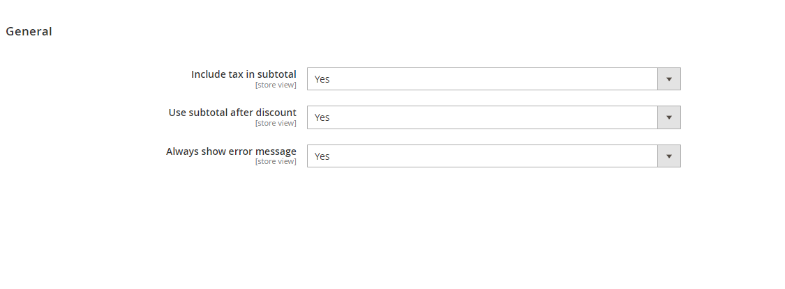
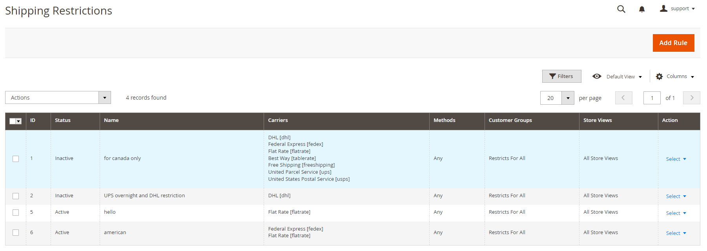
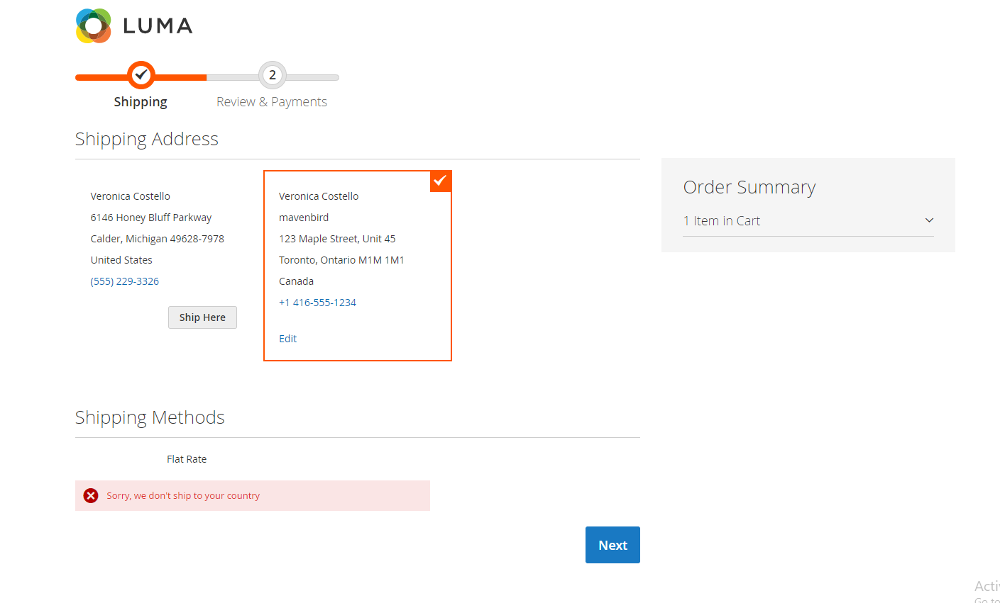

# Magento 2 Shipping Restrictions Extension

Enhance your Magento 2 store's shipping strategy with the Shipping Restrictions Extension. This module empowers you to customize delivery methods and optimize shipping operations according to your business needs.

**[Shipping Restrictions Extension for Magento 2](https://www.mavenbird.com/shipping-restrictions-extension)** 

## Key Features:

- **Selective Carrier Method Restrictions:** 
  Restrict unnecessary shipping methods offered by carriers based on product type or customer segment.
  
- **Comprehensive Rule Creation:** 
  Create shipping restrictions based on customer attributes, cart contents, or product attributes to comply with legal regulations and optimize costs.
  
- **Efficient Shipping Area Management:** 
  Define shipping areas by countries, states, regions, cities, or zip codes, and apply uniform restrictions across entire areas.
  
- **Postcode-based Restrictions:** 
  Set specific delivery restrictions based on postcode criteria (e.g., starting with '123' or ending with 'XYZ').
  
- **Dynamic Customer Group Management:** 
  Tailor shipping methods for specific customer groups such as wholesale users or retail customers.
  
- **Flexible Coupon and Order Subtotal Handling:** 
  Adjust shipping options based on order subtotal or coupon usage to manage promotional campaigns effectively.
  
- **Product Attribute-based Rules:** 
  Customize shipping methods based on product attributes (e.g., exclude ground mail for premium brands).
  
- **Day-specific Restrictions:** 
  Temporarily restrict shipping on specific days (e.g., weekends or holidays) to align with operational schedules.
  
- **Store View and Website-specific Settings:** 
  Configure shipping methods per store view or website to manage global operations efficiently.
  
- **Back-Ordered Item Handling:** 
  Manage shipping options for items on back-order, ensuring accurate delivery promises.

## Benefits:

- **Tailored Shipping Strategy:** 
  Adapt shipping methods to meet specific business requirements and customer expectations.
  
- **Compliance and Efficiency:** 
  Ensure adherence to legal requirements and optimize shipping costs for improved business profitability.
  
- **Enhanced Customer Satisfaction:** 
  Provide a seamless shipping experience that meets diverse customer needs and preferences.
  
- **Flexible and Scalable:** 
  Scale your shipping strategy as your business grows, accommodating new products and market demands.

## Compatibility:
This extension is compatible with Magento 2.x versions, ensuring seamless integration with your existing store setup.

## Installation:
**Install via composer (recommended)**

Easy installation process with step-by-step instructions provided for hassle-free setup.
~~~~~~~~~~~~~~~~~~~~~~~~~~~~
composer require Mavenbird/shipping-restrictions-extension
php bin/magento setup
php bin/magento setup:static-content
php bin/magento setup:di
php bin/magento cache
~~~~~~~~~~~~~~~~~~~~~~~~~~~~

## Upgrade/Update Module:
Run the following command in Magento 2 root folder for easy update -
~~~~~~~~~~~~~~~~~~~~~
composer update Mavenbird/shipping-restrictions-extension
php bin/magento setup
php bin/magento setup:static-content
php bin/magento setup:di
php bin/magento cache
~~~~~~~~~~~~~~~~~~~~~

## Customization Options:
Customize shipping restriction settings with configurable templates and flexible configurations to match your store's needs.

**Example Configuration Screenshots:**

## Support:
For installation, customization, or any queries, our dedicated support team is available.
**Email: [support@mavenbird.com](support@mavenbird.com)** 

## Get Started:
Enhance your Magento 2 store's shipping management with the Shipping Restrictions Extension. Adapt shipping methods to optimize costs and meet customer expectations effectively.

**Thank you!**